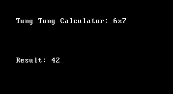
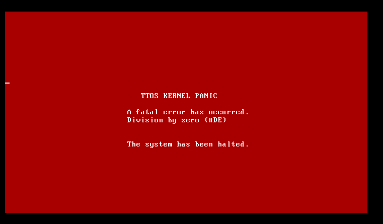

# TungTung OS
Are you tired of massive bloated Javascript apps ruining your ram usage? Tired of the convinence of a calculator built into google?
Are you tired of having negative opsec because intel me? tung tung os is so useless, nobody would ever
hack you



## WHAT???
TungTungOS is the solution for you. It runs in 32 bit protectted mode on real x86 hardware, running a
real kernel, launched by the most secure bootloader in the world!

## How??
Using a custom bootloader, that does 0 verifications, using legacy BIOS mode, TungTungOS can literally
load a small c++ kernel witth an in built ring3 program called TungTungCalculator.

Features:
 - ps/2 input
 - PIT 100hz access
 - IDT setup
 - 32-bit paging
 - Ring 0/3 privilege selection
 - Panics!



## Sign me up
Install today! Go to the releases tab and get your .iso today, launch with qemu, or run on real
hardware if you dare.

Run on Qemu:
```
qemu-system-i386 -drive format=raw,file=<FILE NAME>
```  

Flash to a real iso (at your own risk!)
```
sudo dd if=<FILE NAME> of=/dev/sdX bs=4M status=progress conv=fsync
```

## Build
Ensure `nasm`, `g++`, and any linker is installed. Run:

`chmod +x build.sh`
`./build.sh`
